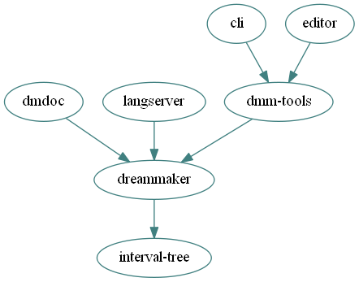

# SpacemanDMM`/src`

SpacemanDMM consists of several packages. Each may be built by running
`cargo build -p <name>` from the repository root. If no `-p` flag is
specified, all packages will be built. Adding `--release` will enable more
optimization flags, taking longer to compile but producing faster executables.

* [dreammaker](dreammaker/) - a pure-Rust parsing suite for the DreamMaker
  programming language.

* [dm-langserver](langserver/) - a [language server] based upon that parser.

* [dmdoc](dmdoc/) - a doxygen-esque documentation generator for DreamMaker codebases.

* [dmm-tools](tools/) - additional libraries for working with DreamMaker icon
  and map files, including a renderer.

* [cli](cli/) - the command-line interface to `dmm-tools`.

* [spaceman-dmm](editor/) - a very early prototype of a map editor meant as an
  alternative to DreamMaker's default.

[language server]: https://langserver.org/
